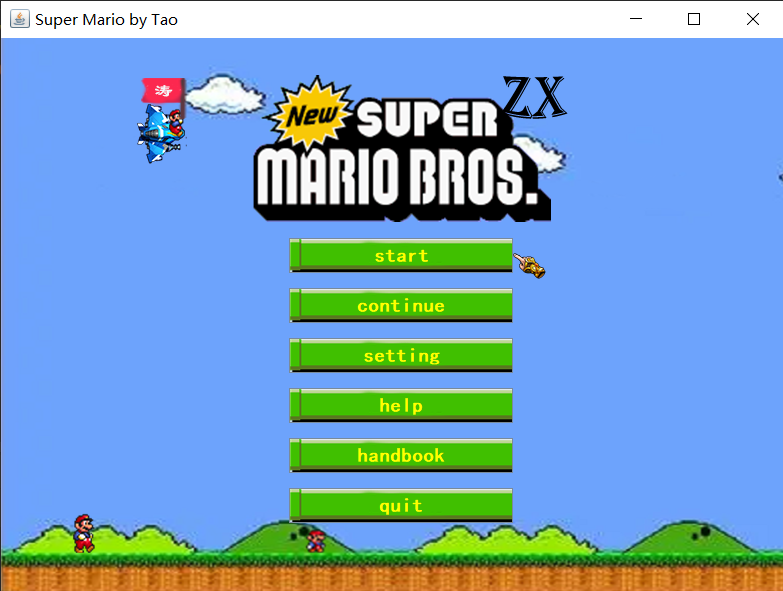
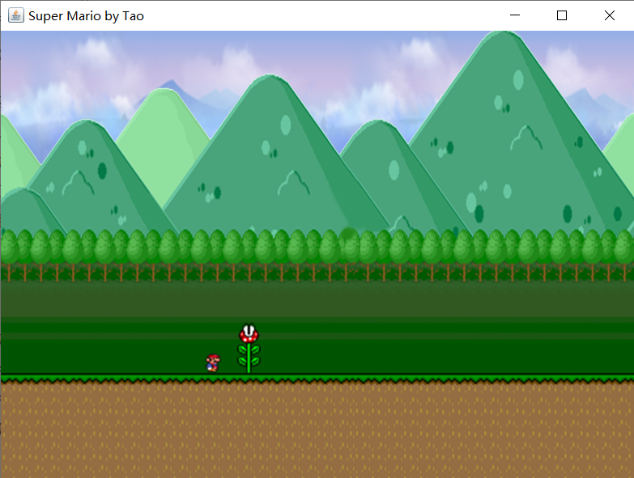

# 2022.7.17

大二暑假，Java练手项目。

# 语言选项

两个配置文件，显示中文和英文，组件的文字通过配置文件获取。

- menu_CH.properties

```properties
0=开始游戏
1=继续游戏
2=游戏设置
3=游戏帮助
4=图鉴
5=退出游戏
menuTitle=超级玛丽 by 涛
helpTitle=帮助
help=本游戏完成于2022年7月17日 作者：涛\
  \n大二暑假 Java练手\
  \n主界面：向上向下箭头控制选择，Enter键确定。支持点击选择。\
  \n游戏界面：\
  \n敬请期待
settingTitle=设置
settingMusicLabel=音效设置
settingCheckBox1=背景音乐
settingCheckBox2=局内音乐
settingCheckBox3=按键音效
settingLanguageLabel=语言选项
settingRadioBox1=中文
settingRadioBox2=英文
```

- menu_US.properties

```properties
0=start
1=continue
2=setting
3=help
4=handbook
5=quit
menuTitle=Super Mario by Tao
helpTitle=help
help=This game was completed on July 17, 2022 by: Tao \
\n Sophomore summer vacation Java practice \
\n Main interface: up and down arrow control selection, \
\n Enter key to confirm. Click to select. \
\n Game interface: \
\n Stay tuned
settingTitle=setting
settingMusicLabel=Sound Settings
settingCheckBox1=bgMusic
settingCheckBox2=game
settingCheckBox3=click
settingLanguageLabel=Language Choice
settingRadioBox1=chinese
settingRadioBox2=english
```


# 游戏的管理类

- 保存游戏菜单
- 保存窗口的属性
- 音乐播放控制
- 等等。。。

```java
package com.zx.mario.manager;

import com.zx.mario.domain.Status;
import com.zx.mario.service.MessageService;
import com.zx.mario.view.Menu;
import java.util.HashMap;
import java.util.Map;
public class Application {
    //语言
    public static int language = MessageService.ENGLISH;
    //是否开始游戏
    public static boolean startGame = false;
    //菜单
    public static Menu menu;
    public static int menuGrassY = 515;
    //窗口大小
    public static final int WindowWidth = 800;
    public static final int WindowHeight = 600;
    //设置模块
    public static boolean isSelectPlayBackgroundMusic = true;//播放背景音乐
    public static boolean isSelectPlayGameSoundEffect = true;//播放游戏音效
    public static boolean isSelectPlayClickSoundEffect = true;//播放按键音效
    //游戏模块
    public static String getFilePrefixByStatus(Status status){
        return status.toString();
    }
    public static int gameGrassY = 461;
    //玛丽奥每种状态图片的数量
    private static final Map<Status, Integer> statusToImgSize;
    static {
        statusToImgSize = new HashMap<>();
        statusToImgSize.put(Status.s_mario_die, 1);
        statusToImgSize.put(Status.s_mario_jump_L, 2);
        statusToImgSize.put(Status.s_mario_jump_R, 2);
        statusToImgSize.put(Status.s_mario_run_L, 2);
        statusToImgSize.put(Status.s_mario_run_R, 2);
        statusToImgSize.put(Status.s_mario_stand_L, 1);
        statusToImgSize.put(Status.s_mario_stand_R, 1);
        statusToImgSize.put(Status.s_mario_stop_L, 1);
        statusToImgSize.put(Status.s_mario_stop_R, 1);
    }
    public static int getImgSizeByStatus(Status status){
        return statusToImgSize.get(status);
    }
}
```

# 工具类

## 声音相关

```java
package com.zx.mario.utils;

import javax.sound.sampled.*;
import java.io.*;
import java.net.URL;
public class SoundUtil {
    //背景音乐:向外界提供该对象用于暂停或播放
    public static AudioDao backgroundMusic;
    //存放音频的目录
    private static final String path = "/com/zx/mario/sounds/";

    /**
     * 播放一次音声
     * @param fileName 文件名
     */
    public static void playSound(String fileName){
        //'/'表示绝对资源位置，考虑到要包装为jar包，获取资源资源使用这种方式
        URL url = AudioDao.class.getResource(path + fileName);
        AudioDao audioDao = new AudioDao();
        audioDao.open(url);
        audioDao.load();
        audioDao.start();
    }
    /**
     * 背景音乐
     */
    public static void playBackgroundMusic(String fileName){
        URL url = AudioDao.class.getResource(path + fileName);
        backgroundMusic = new AudioDao();//通过向外界提供该实例，用于播放或暂停
        backgroundMusic.open(url);
        backgroundMusic.load();
        backgroundMusic.loop();
        backgroundMusic.start();
    }
    public static void shutDownBackgroundMusic(){
        if(backgroundMusic != null){
            backgroundMusic.stop();
        }
    }
    public static void openBackgroundMusic(){
        if(backgroundMusic != null){
            backgroundMusic.start();
        }
    }


//    public static void main(String[] args) {
////        将MP3文件转为wav文件
//        String fileName = "点击4";
//        String filePath = "D:\\" + fileName + ".mp3";
//        String targetPath = "D:\\" + fileName +".wav";
//        byteToWav(getBytes(filePath), targetPath);
//    }

    public static boolean byteToWav(byte[] sourceBytes, String targetPath){
        if (sourceBytes == null || sourceBytes.length == 0) {
            System.out.println("Illegal Argument passed to this method");
            return false;
        }
        try (final ByteArrayInputStream bais = new ByteArrayInputStream(sourceBytes);
             final AudioInputStream sourceAIS = AudioSystem.getAudioInputStream(bais)) {
            AudioFormat sourceFormat = sourceAIS.getFormat();
            // 设置MP3的语音格式,并设置16bit
            AudioFormat mp3tFormat = new AudioFormat(AudioFormat.Encoding.PCM_SIGNED, sourceFormat.getSampleRate(), 16, sourceFormat.getChannels(), sourceFormat.getChannels() * 2, sourceFormat.getSampleRate(), false);
            // 设置阿里语音识别的音频格式
            AudioFormat pcmFormat = new AudioFormat(AudioFormat.Encoding.PCM_SIGNED, 16000, 16, 1, 2, 16000, false);
            try (
                    // 先通过MP3转一次，使音频流能的格式完整
                    final AudioInputStream mp3AIS = AudioSystem.getAudioInputStream(mp3tFormat, sourceAIS);
                    // 转成阿里需要的流
                    final AudioInputStream pcmAIS = AudioSystem.getAudioInputStream(pcmFormat, mp3AIS)) {
                // 根据路径生成wav文件
                AudioSystem.write(pcmAIS, AudioFileFormat.Type.WAVE, new File(targetPath));
            }
            return true;
        } catch (IOException | UnsupportedAudioFileException e) {
            e.printStackTrace();
//            System.out.println("文件转换异常：" + e.getMessage());
            return false;
        }

    }

    public static byte[] getBytes(String filepath){
        byte[] buffer = null;
        try{
            File file =  new File(filepath);
            FileInputStream fis = new FileInputStream(file);
            ByteArrayOutputStream bos = new ByteArrayOutputStream();
            byte[] b = new byte[1000];
            int n;
            while((n=fis.read(b))!=-1){
                bos.write(b,0,n);
            }
            fis.close();
            bos.close();
            buffer = bos.toByteArray();

        }catch(Exception e){
            e.printStackTrace();
        }
        return buffer;
    }
}
//音频访问对象 支持wav mid
class AudioDao {
    private AudioInputStream stream;//音频输入流
    private AudioFormat format;//音频格式
    private Clip clip;//音频夹

    /**
     * 打开声音文件方法
     * @param url 文件路径
     */
    public void open(URL url) {
        try {
            stream = AudioSystem.getAudioInputStream(url);//音频输入流
            format = stream.getFormat();//音频格式对象
        } catch (UnsupportedAudioFileException | IOException e) {
            e.printStackTrace();
        }
    }

    /**
     * 建立播放音频的音频行
     */
    public void load() {
        //音频行信息
        DataLine.Info info = new DataLine.Info(Clip.class, format);//音频行信息
        try {
            clip = (Clip) AudioSystem.getLine(info);
            clip.open(stream);//将音频数据读入音频行
        } catch (LineUnavailableException | IOException e) {
            e.printStackTrace();
        }
    }

    public void stop() {
        clip.stop();//暂停音频播放
    }

    public void start() {
        clip.start();//播放音频
    }

    public void loop() {
        clip.loop(Clip.LOOP_CONTINUOUSLY);//循环播放
    }
}
```

## 图片相关

```java
package com.zx.mario.utils;

import javax.imageio.ImageIO;
import javax.swing.*;
import java.awt.image.BufferedImage;
import java.io.IOException;
import java.net.URL;
public class ImageUtil {
    public static String path = "/com/zx/mario/img/";
    //获取图片
    public static BufferedImage getImage(String fileName){
        URL url = ImageUtil.class.getResource(path + fileName);
//        if(url == null){
//            return null;
//        }
        if(url == null){
            throw new RuntimeException("文件加载失败！");
        }

        BufferedImage bufferedImage = null;
        try {
            bufferedImage = ImageIO.read(url);
        } catch (IOException e) {
            e.printStackTrace();
        }
        return bufferedImage;
    }
    //获取图标
    public static ImageIcon getIcon(String fileName){
        URL url = ImageUtil.class.getResource(path + fileName);
        if(url == null){
            throw new RuntimeException("文件加载失败！");
        }
        return new ImageIcon(url);
    }
}
```

## 数学相关

```java
public class MathUtil {
    private static Random random = new Random();

    public static int getRandomNum(int min, int max){
        return random.nextInt(max - min) + min;
    }
}
```

# 服务模块

调用工具类或自己提供相应的静态方法，提供游戏的功能支持。

## 消息服务

```java
package com.zx.mario.service;

import javax.swing.*;
import java.awt.*;
import java.awt.event.*;
import java.io.IOException;
import java.net.URL;
import java.util.Properties;

import static com.zx.mario.manager.Application.*;

/**
 * @author 挚爱之夕
 * @version 1.0
 * @implSpec 负责处理文件和消息显示
 * @since 2022 - 07 - 17 - 14:28
 */
public class MessageService {
    //配置文件
    private static final Properties properties;
    //统一资源定位符
    private static URL url;
    //配置文件在工程中的路径
    private static String path = "/com/zx/mario/language/";
    //语言
    public static final int CHINESE = 0;
    public static final int ENGLISH = 1;

    static {
        properties = new Properties();
    }

    /**
     * 根据语言选项，加载对应的配置文件
     * @param language 语言 0-中文 1-英文
     */
    private static void load(int language) {
        if (language == 0) {
            try {
                url = MessageService.class.getResource(path + "menu_CH.properties");
                assert url != null;
                properties.load(url.openStream());
            } catch (IOException e) {
                e.printStackTrace();
            }
        } else {
            try {
                url = MessageService.class.getResource(path + "menu_US.properties");
                assert url != null;
                properties.load(url.openStream());
            } catch (IOException e) {
                e.printStackTrace();
            }
        }
    }

    /**
     * 获取菜单界面的按钮文字
     *
     * @param language 指定的语言
     * @return 文字数组
     */
    public static String[] getMenuText(int language) {
        String[] result = new String[6];
        //加载文件
        load(language);
        for (int i = 0; i < 6; i++) {
            result[i] = properties.getProperty("" + i);
        }
        return result;
    }

    /**
     * 获取组件文字
     * @param key 关键字
     * @return 组件文字
     */
    public static String getTextByLanguage(String key) {
        load(language);
        return properties.getProperty(key);
    }

    /**
     * 在主菜单显示游戏帮助
     *
     * @param frame    父窗口
     * @param language 语言
     * @see MessageService
     */
    public static void showGameHelpMessage(JFrame frame, int language) {
        String message = MessageService.getTextByLanguage("help");
        ImageIcon helpIcon = ImageFactory.getIcon("help.png");
        JOptionPane.showMessageDialog(frame, message, getTextByLanguage("helpTitle"), JOptionPane.INFORMATION_MESSAGE, helpIcon);
    }

    /*游戏设置*/
    public static void showGameSetting(JFrame parent) {
        //显示对话框
        JDialog dialog = new JDialog(parent, getTextByLanguage("settingTitle"));
        //对话框添加事件监听，关闭窗口显示主界面
        dialog.addWindowListener(new WindowAdapter() {
            @Override
            public void windowClosing(WindowEvent e) {
//                System.out.println("关闭");
                menu.setVisible(true);
            }
        });
        dialog.setLocationRelativeTo(parent);
        dialog.setBounds(parent.getBounds().x, parent.getBounds().y + 100, 800, 400);
        dialog.setIconImage(ImageFactory.getImg("setting.png"));
        dialog.setResizable(false);
        dialog.setVisible(true);
        dialog.setLayout(null);
        Font titleFont = new Font("楷体", Font.BOLD, 20);
        Font textFont = new Font("楷体", Font.BOLD, 15);
        /*音效设置*/
        //音乐标签
        JLabel musicLabel = new JLabel(getTextByLanguage("settingMusicLabel"));
        musicLabel.setBounds(10, -20, 600, 100);
        musicLabel.setFont(titleFont);
        dialog.add(musicLabel);
        //复选按钮：背景音乐、爆炸音效、按键音效
        JCheckBox checkBox1 = new JCheckBox(getTextByLanguage("settingCheckBox1"));
        JCheckBox checkBox2 = new JCheckBox(getTextByLanguage("settingCheckBox2"));
        JCheckBox checkBox3 = new JCheckBox(getTextByLanguage("settingCheckBox3"));
        checkBox1.setBounds(10, 70, 100, 30);
        checkBox2.setBounds(150, 70, 100, 30);
        checkBox3.setBounds(290, 70, 100, 30);
        checkBox1.setFont(textFont);
        checkBox2.setFont(textFont);
        checkBox3.setFont(textFont);
        //添加到对话框
        dialog.add(checkBox1);
        dialog.add(checkBox2);
        dialog.add(checkBox3);
        //设置选中状态
        if (isSelectPlayBackgroundMusic)
            checkBox1.setSelected(true);
        if (isSelectPlayGameSoundEffect)
            checkBox2.setSelected(true);
        if (isSelectPlayClickSoundEffect)
            checkBox3.setSelected(true);
        //背景音乐
        checkBox1.addItemListener(e -> {
            isSelectPlayBackgroundMusic = !isSelectPlayBackgroundMusic;
            if (isSelectPlayBackgroundMusic) {
                MusicService.startBackGroundMusic();
            } else {
                MusicService.stopBackGroundMusic();
            }
        });
        //游戏音效
        checkBox2.addItemListener(e -> {
            isSelectPlayGameSoundEffect = !isSelectPlayGameSoundEffect;
        });
        //点击音效
        checkBox3.addItemListener(e -> isSelectPlayClickSoundEffect = !isSelectPlayClickSoundEffect);

        /*语言选项*/
        JLabel languageLabel = new JLabel(getTextByLanguage("settingLanguageLabel"));
        languageLabel.setBounds(10, 120, 600, 100);
        languageLabel.setFont(titleFont);
        dialog.add(languageLabel);

        //单选按钮
        ButtonGroup group = new ButtonGroup();
        JRadioButton chineseBtn = new JRadioButton();
        chineseBtn.setBounds(10, 200, 20, 20);
        group.add(chineseBtn);
        dialog.add(chineseBtn);
        JRadioButton englishBtn = new JRadioButton();
        englishBtn.setBounds(10, 250, 20, 20);
        group.add(englishBtn);
        dialog.add(englishBtn);

        //标签
        JLabel chinesLabel = new JLabel(getTextByLanguage("settingRadioBox1"));
        chinesLabel.setBounds(50, 200, 100, 30);
        chinesLabel.setVerticalAlignment(SwingConstants.TOP);
        chinesLabel.setHorizontalAlignment(SwingConstants.LEFT);
        chinesLabel.setFont(textFont);
        dialog.add(chinesLabel);
        JLabel englishLabel = new JLabel(getTextByLanguage("settingRadioBox2"));
        englishLabel.setBounds(50, 250, 100, 30);
        englishLabel.setVerticalAlignment(SwingConstants.TOP);
        englishLabel.setHorizontalAlignment(SwingConstants.LEFT);
        englishLabel.setFont(textFont);
        dialog.add(englishLabel);
        //语言选择 
        if(language == ENGLISH){
            englishBtn.setSelected(true);
        }else{
            chineseBtn.setSelected(true);
        }

        //两个按钮是同一个组，状态同时变化，添加一个监听即可
        englishBtn.addItemListener(new ItemListener() {
            @Override
            public void itemStateChanged(ItemEvent e) {
//                System.out.println("语言切换");
                System.out.println(englishLabel.getBounds());
                if(englishBtn.isSelected()){
                    language = ENGLISH;
                }else{
                    language = CHINESE;
                }
                dialog.setTitle(getTextByLanguage("settingTitle"));
                musicLabel.setText(getTextByLanguage("settingMusicLabel"));
                checkBox1.setText(getTextByLanguage("settingCheckBox1"));
                checkBox2.setText(getTextByLanguage("settingCheckBox2"));
                checkBox3.setText(getTextByLanguage("settingCheckBox3"));
                languageLabel.setText(getTextByLanguage("settingLanguageLabel"));
                chinesLabel.setText(getTextByLanguage("settingRadioBox1"));
                englishLabel.setText(getTextByLanguage("settingRadioBox2"));
                //刷新主界面
                menu.flush();
            }
        });
        //点击标签，也触发事件
        englishLabel.addMouseListener(new MouseAdapter() {
            @Override
            public void mouseClicked(MouseEvent e) {
//                System.out.println("点击英文标签");
                englishBtn.setSelected(true);
            }
        });
        chinesLabel.addMouseListener(new MouseAdapter() {
            @Override
            public void mouseClicked(MouseEvent e) {
//                System.out.println("点击中文标签");
                chineseBtn.setSelected(true);
            }
        });

    }
}
```


## 图片工厂

- 加载图片资源
- 向外界提供获取图片对象的方法

```java
package com.zx.mario.service;

import com.zx.mario.utils.ImageUtil;

import javax.swing.*;
import java.awt.image.BufferedImage;
import java.io.File;
import java.net.URISyntaxException;
import java.net.URL;
import java.util.HashMap;
import java.util.Map;

/**
 * @author 挚爱之夕
 * @version 1.0
 * @implSpec 负责加载图片资源，向外提供接口
 * @since 2022 - 07 - 18 - 9:55
 */
public class ImageFactory {
    private static final String path = "/com/zx/mario/img";
    //存储所有ImageIcon
    private static Map<String, ImageIcon> imageIconMap;
    //存储所有BufferedImage
    private static Map<String, BufferedImage> imageMap;
    static {
        imageIconMap = new HashMap<>();
        imageMap = new HashMap<>();
        init();
    }
    public static void init(){
        //通过反射 加载所有图片资源
        URL url = Object.class.getResource(path);
        assert url != null;
        File file = null;
        try {
            //得到目录对象
            file = new File(url.toURI());
            if(file.isDirectory()){
                //遍历目录下的文件
                File[] files = file.listFiles();
                if(files != null){
                    for (File f:files
                    ) {
                        String fileName = f.getName();
                        //得到图片对象
                        BufferedImage img = ImageUtil.getImage(fileName);
                        ImageIcon imageIcon = ImageUtil.getIcon(fileName);
                        //将文件名作为键，保存的map中
                        imageMap.put(f.getName(), img);
                        imageIconMap.put(f.getName(), imageIcon);
//                        System.out.println(f.getName());
                    }
                }
            }
        } catch (URISyntaxException e) {
            e.printStackTrace();
        }
    }
    public static ImageIcon getIcon(String name){
        return imageIconMap.get(name);
    }
    public static BufferedImage getImg(String name){
        return imageMap.get(name);
    }
}
```


## 音乐服务

```java
package com.zx.mario.service;

import com.zx.mario.utils.SoundUtil;

/**
 * @author 挚爱之夕
 * @version 1.0
 * @implSpec 音乐相关的操作
 * @since 2022 - 07 - 17 - 14:57
 */
public class MusicService {
    //播放背景音乐
    public static void playBackGroundMusic(String filename){
        SoundUtil.playBackgroundMusic(filename);
    }
    //暂停播放背景音乐
    public static void stopBackGroundMusic(){
        SoundUtil.shutDownBackgroundMusic();
    }
    //继续播放背景音乐
    public static void startBackGroundMusic(){
        SoundUtil.openBackgroundMusic();
    }
    //播放音效
    public static void playSound(String filename){
        SoundUtil.playSound(filename);
    }
}
```

# 游戏菜单



## 界面实现

### 窗口

- 继承JFrame, 通过MessageService 获取并设置标题文字， 通过ImageFactory 获取 Icon 并设置
- 设置空布局等属性
- 设置键盘监听事件
- 保存当前对象到Application
- 相应的事件调用对应的功能模块

### 背景

- 窗口大小的label设置到窗口的分层面板，并设置内容面板透明

### 动景

- 新建MenuObject类继承JLabel
- 窗口实现Runnable接口，每50ms,更新label的位置

### 按钮和选择标签

- 数组形式循环添加
- 通过MessageService 获取文字， 通过ImageFactory 获取 Icon 并设置

- 按钮设置图标等属性加入到窗口合适位置
- 设置按钮的监听器，调用相关模块方法
- 手指标签初始显示第一个
- 窗口的监听事件：上下箭头让相应手指标签显示
- 调用MusicService 播放相应音乐

```java
package com.zx.mario.view;


import com.zx.mario.domain.MenuObject;
import com.zx.mario.service.ImageFactory;
import com.zx.mario.service.MessageService;
import com.zx.mario.manager.Application;
import com.zx.mario.service.MusicService;

import javax.swing.*;
import java.awt.*;
import java.awt.event.*;

/**
 * @author 挚爱之夕
 * @version 1.0
 * @implSpec com.zx.mario.view
 * @since 2022 - 07 - 17 - 10:30
 */
public class Menu extends JFrame implements Runnable{
    //背景
    private JLabel back;
    //图标
    private JLabel title;
    //用于选择的五个手指
    private JLabel[] fingers;
    //五个按钮
    private JButton[] buttons;
    //马里奥
    private MenuObject mario1;
    private MenuObject mario2;
    private MenuObject mario3;
    //云
    private MenuObject cloud1;
    private MenuObject cloud2;
    private MenuObject cloud3;
    public Menu(){
        //标题
        this.setTitle(MessageService.getTextByLanguage("menuTitle"));
        this.setIconImage(ImageFactory.getImg("menuIcon"));
        //窗口大小
        this.setSize(800, 600);
//        this.setResizable(false);
        //默认关闭行为
        this.setDefaultCloseOperation(JFrame.EXIT_ON_CLOSE);
        //布局
        this.setLayout(null);
        //窗口居中
        this.setLocationRelativeTo(null);

        //初始化 （窗口背景、按钮、标签等）
        init();
        //设置监听 （键盘监听、聚焦监听）
        setListener();
        //获取焦点 （窗口可聚焦）
        this.setFocusable(true);
//        this.requestFocus();
        showMenu();
        //保存窗口对象
        Application.menu = this;
        //播放背景音乐
        MusicService.playBackGroundMusic("menuSound.wav");


        //背景人物
        mario1 = new MenuObject(0, Application.menuGrassY - 40, 3, 2, "mario_R_run", 0);
        add(mario1);
        mario2 = new MenuObject(200, Application.menuGrassY - 25, 2, 3, "s_mario_run_R", 0);
        add(mario2);
        mario3 = new MenuObject(0, 40, 1, 4, "plane", 0);
        add(mario3);
        //云
        cloud1 = new MenuObject(200, 20, 1, -1, "cloud", 0);
        add(cloud1);
        cloud2 = new MenuObject(800, 100, 1, -1, "cloud", 0);
        add(cloud2);
        cloud3 = new MenuObject(500, 80, 1, -1, "cloud", 0);
        add(cloud3);
        //启动窗口的线程
        new Thread(this).start();
    }

    /**
     * 该方法用于语言切换
     */
    public void flush(){
        //标题
        this.setTitle(MessageService.getTextByLanguage("menuTitle"));
        //初始界面 英文
        String[] menuText = MessageService.getMenuText(Application.language);
        for(int i = 0; i < 6; i++){
            buttons[i].setText(menuText[i]);
        }
    }
    public void showMenu(){
        this.setVisible(true);
    }
    private void init(){
        //菜单背景
        back = new JLabel(ImageFactory.getIcon("menuBg.png"));
        setBackground();
        //游戏图标
        ImageIcon titleIcon = ImageFactory.getIcon("title.png");
        title = new JLabel(titleIcon);
        title.setBounds((800 - titleIcon.getIconWidth()) / 2, 0, titleIcon.getIconWidth(), 200);
        add(title);
        //五个按钮
        buttons = new JButton[6];
        ImageIcon btnIcon = ImageFactory.getIcon("btn.png");
        //初始界面 英文
        String[] menuText = MessageService.getMenuText(Application.language);
//        Application.language = MessageService.ENGLISH;
        int x = (800 - btnIcon.getIconWidth()) / 2, y = 200;
        for(int i = 0; i < 6; i++){
            //带图片和文字的按钮
            buttons[i] = new JButton(menuText[i], btnIcon);
            //设置字体
            buttons[i].setFont(new Font("楷体", Font.BOLD, 20));
            //设置字体颜色
            buttons[i].setForeground(Color.YELLOW);
            //设置文本对齐方式
            buttons[i].setHorizontalTextPosition(SwingConstants.CENTER);
            buttons[i].setVerticalTextPosition(SwingConstants.CENTER);
            //设置按钮位置（空布局使用setBounds方法）
            buttons[i].setBounds(x, y + i * 50, btnIcon.getIconWidth(), btnIcon.getIconHeight());
            this.add(buttons[i]);
        }
        //6个手指
        fingers = new JLabel[6];
        ImageIcon fingerIcon = ImageFactory.getIcon("finger.png");
        x = (800 + btnIcon.getIconWidth()) / 2;
        y = 215;
        for(int i = 0; i < 6; i++){
            fingers[i] = new JLabel(fingerIcon);
            fingers[i].setBounds(x, y + i * 50, fingerIcon.getIconWidth(), fingerIcon.getIconHeight());
            //显示第一个
            fingers[i].setVisible(i == 0);
            this.add(fingers[i]);
        }
    }
    private void setListener(){
        //窗口添加键盘监听事件， 上下箭头选择
        this.addKeyListener(new KeyAdapter() {
            @Override
            public void keyPressed(KeyEvent e) {
                int keyCode = e.getKeyCode();
                System.out.println(keyCode + "  kk");
                int index = getVisibleIndex();
                //确认
                if(keyCode == KeyEvent.VK_ENTER){
                    if(Application.isSelectPlayClickSoundEffect)
                        MusicService.playSound("click2.wav");
                    choice(index);
                }

                //选择菜单
                if(keyCode == KeyEvent.VK_UP){
                    if(Application.isSelectPlayClickSoundEffect)
                        MusicService.playSound("click1.wav");
                    fingers[index].setVisible(false);
                    if(index == 0){
                        fingers[5].setVisible(true);
                    }else{
                        fingers[index - 1].setVisible(true);
                    }
                }else if(keyCode == KeyEvent.VK_DOWN){
                    if(Application.isSelectPlayClickSoundEffect)
                        MusicService.playSound("click1.wav");
                    fingers[index].setVisible(false);
                    if(index == 5){
                        fingers[0].setVisible(true);
                    }else{
                        fingers[index + 1].setVisible(true);
                    }
                }


            }
        });
        //为按钮添加聚焦事件，单击触发
        for(int i = 0; i < 5; i++){
            addFocusListenerToButton(i);
        }

    }

    /**
     * 设置图片为窗口背景
     */
    private void setBackground() {
        //设置背景图片位置大小
        back.setBounds(0, -45, 800, 600);
        //面板透明
        JPanel j = (JPanel)getContentPane();
        j.setOpaque(false);
        //设置背景
        getLayeredPane().add(back, new Integer(Integer.MIN_VALUE));//背景添加到分层面板
    }

    //获取唯一显示的手指对应的数组中的下标
    private int getVisibleIndex(){
        for (int i = 0; i < 6; i++) {
            if(fingers[i].isVisible()){
                return i;
            }
        }
        return -1;
    }

    //开始游戏
    private void startGame(){
        System.out.println("开始游戏");
//        JOptionPane.showMessageDialog(this, "功能开发中，敬请期待");
        GameWindow gameWindow = new GameWindow();
        this.setVisible(false);
        gameWindow.setVisible(true);
        gameWindow.addWindowListener(new WindowAdapter() {
            @Override
            public void windowClosing(WindowEvent e) {
                Application.menu.setVisible(true);
            }
        });
    }
    //继续游戏
    private void continueGame(){
        System.out.println("继续游戏");
        JOptionPane.showMessageDialog(this, "没有存档，请开始游戏");
    }
    //游戏设置
    private void setting(){
        this.setVisible(false);
        System.out.println("游戏设置");
        MessageService.showGameSetting(this);
    }
    //游戏帮助
    private void help(){
        System.out.println("游戏帮助");
        MessageService.showGameHelpMessage(this, Application.language);
    }
    //手册
    private void handBook(){
        System.out.println("图鉴");
        JOptionPane.showMessageDialog(this, "功能开发中，敬请期待");
    }
    //退出游戏
    private void quitGame(){
        System.out.println("退出游戏");
        System.exit(0);
    }

    /**
     * 为按钮添加聚焦事件，单击触发
     * @param index 按钮在按钮数组中对应的下标
     */
    private void addFocusListenerToButton(int index){
        buttons[index].addFocusListener(new FocusAdapter() {
            @Override
            public void focusGained(FocusEvent e) {
                if(e.getSource().equals(buttons[index])){
                    if(Application.isSelectPlayClickSoundEffect)
                        MusicService.playSound("btnSound.wav");
                    int visibleIndex = getVisibleIndex();
                    if(visibleIndex != index){
                        fingers[visibleIndex].setVisible(false);
                        fingers[index].setVisible(true);
                    }
                    //聚焦窗口
                    Application.menu.requestFocus();
                    //调用对应模块
                    choice(index);
                }
            }
        });
    }

    /**
     * 选择菜单模块
     * @param index 模块对应的下标
     */
    private void choice(int index){
        switch (index){
            case 0:
                startGame();
                break;
            case 1:
                continueGame();
                break;
            case 2:
                setting();
                break;
            case 3:
                help();
                break;
            case 4:
                handBook();
                break;
            case 5:
                quitGame();
                break;
        }
    }
    @Override
    public void run() {
        while(!Application.startGame){
            try {
                mario1.move();
                mario2.move();
                mario3.move();
                cloud1.move();
                cloud2.move();
                cloud3.move();
                Thread.sleep(50);
            } catch (InterruptedException e) {
                e.printStackTrace();
            }
            repaint();
        }
    }

}
```

## 功能实现

### 退出游戏

```java
//退出游戏
private void quitGame(){
    System.out.println("退出游戏");
    System.exit(0);
}
```

### 开始游戏

- 创建游戏窗口并显示
- 隐藏当前窗口

```java
//开始游戏
private void startGame(){
    System.out.println("开始游戏");
    //        JOptionPane.showMessageDialog(this, "功能开发中，敬请期待");
    GameWindow gameWindow = new GameWindow();
    this.setVisible(false);
    gameWindow.setVisible(true);
    gameWindow.addWindowListener(new WindowAdapter() {
        @Override
        public void windowClosing(WindowEvent e) {
            Application.menu.setVisible(true);
        }
    });
}
```

### 继续游戏

```java
//继续游戏
private void continueGame(){
    System.out.println("继续游戏");
    JOptionPane.showMessageDialog(this, "没有存档，请开始游戏");
}
```

### 游戏设置

- 调用MessageService 弹出设置对话框

```java
//游戏设置
private void setting(){
    this.setVisible(false);
    System.out.println("游戏设置");
    MessageService.showGameSetting(this);
}
```

### 游戏帮助

- 调用MessageService 弹出游戏帮助对话框

```java
//游戏帮助
private void help(){
    System.out.println("游戏帮助");
    MessageService.showGameHelpMessage(this, Application.language);
}
```

### 手册

```java
//手册
private void handBook(){
    System.out.println("图鉴");
    JOptionPane.showMessageDialog(this, "功能开发中，敬请期待");
}
```


# 游戏模块

## 实现背景动显

- 创建GameObject类 作为游戏界面所有物体的抽象基类
- 创建BackGround类 表示背景：云和山体
- 创建GameWindow类 继承JFrame，实现Runnable接口，表示游戏窗口
- run 方法里 调用云的move方法



### GameObject

```java
package com.zx.mario.domain;

import com.zx.mario.service.ImageFactory;

import java.awt.*;

/**
 * @author 挚爱之夕
 * @version 1.0
 * @implSpec 游戏中物体的抽象
 * @since 2022 - 07 - 18 - 22:57
 */
public class GameObject {
    //坐标
    protected int x;
    protected int y;
    //图片数
    protected int imgSize;
    //速度
    protected int speed;
    //文件名前缀
    protected String filePrefix;
    //当前图片序列
    protected int currentImgIndex;
    //物体的宽和高
    protected int width;
    protected int height;
    public GameObject(){}
    public GameObject(int x, int y, int imgSize, int speed, String filePrefix, int currentImgIndex) {
        this.x = x;
        this.y = y;
        this.imgSize = imgSize;
        this.speed = speed;
        this.filePrefix = filePrefix;
        this.currentImgIndex = currentImgIndex;
        if(imgSize == 1){
            this.width = ImageFactory.getImg(filePrefix + ".png").getWidth();
            this.height = ImageFactory.getImg(filePrefix + ".png").getHeight();
        }else{
            this.width = ImageFactory.getImg(filePrefix + currentImgIndex + ".png").getWidth();
            this.height = ImageFactory.getImg(filePrefix + currentImgIndex + ".png").getHeight();
        }
    }
    public Image getImg(){
        if(imgSize == 1){
            return ImageFactory.getImg(filePrefix + ".png");
        }else{
            return ImageFactory.getImg(filePrefix + currentImgIndex + ".png");
        }
    }
    public int getX() {
        return x;
    }

    public void setX(int x) {
        this.x = x;
    }

    public int getY() {
        return y;
    }

    public void setY(int y) {
        this.y = y;
    }

    public int getImgSize() {
        return imgSize;
    }

    public void setImgSize(int imgSize) {
        this.imgSize = imgSize;
    }

    public int getSpeed() {
        return speed;
    }

    public void setSpeed(int speed) {
        this.speed = speed;
    }

    public String getFilePrefix() {
        return filePrefix;
    }

    public void setFilePrefix(String filePrefix) {
        this.filePrefix = filePrefix;
    }

    public int getCurrentImgIndex() {
        return currentImgIndex;
    }

    public void setCurrentImgIndex(int currentImgIndex) {
        this.currentImgIndex = currentImgIndex;
    }

    public int getWidth() {
        return width;
    }

    public void setWidth(int width) {
        this.width = width;
    }

    public int getHeight() {
        return height;
    }

    public void setHeight(int height) {
        this.height = height;
    }
}
```


### BackGround

```java
package com.zx.mario.domain;

import com.zx.mario.manager.Application;

/**
 * @author 挚爱之夕
 * @version 1.0
 * @implSpec 游戏背景
 * @since 2022 - 07 - 18 - 23:05
 */
public class BackGround extends GameObject{
    public BackGround(){}
    public BackGround(int x, int y, int speed, String filePrefix){
        super(x, y, 1, speed, filePrefix, 0);
    }
    public void move(){
        x += speed;
        if(x <= -Application.WindowWidth){
            x = 0;
        }
    }
}
```

### GameWindow


```java
package com.zx.mario.view;

import com.zx.mario.domain.BackGround;
import com.zx.mario.domain.Mario;
import com.zx.mario.domain.Status;
import com.zx.mario.manager.Application;
import com.zx.mario.service.ImageFactory;
import com.zx.mario.service.MessageService;

import javax.swing.*;
import java.awt.*;
import java.awt.event.KeyAdapter;
import java.awt.event.KeyEvent;

/**
 * @author 挚爱之夕
 * @version 1.0
 * @implSpec com.zx.mario.view
 * @since 2022 - 07 - 18 - 22:26
 */
public class GameWindow extends JFrame implements Runnable{
    //用于缓存
    private Image bufferedImage;
    private BackGround cloud;
    private BackGround mountain;
    public GameWindow(){
        //标题
        this.setTitle(MessageService.getTextByLanguage("menuTitle"));
        this.setIconImage(ImageFactory.getImg("menuIcon"));
        //窗口大小
        this.setSize(Application.WindowWidth, Application.WindowHeight);
//        this.setResizable(false);
        //默认关闭行为
        this.setDefaultCloseOperation(JFrame.DISPOSE_ON_CLOSE);
        //布局
        this.setLayout(null);
        //窗口居中
        this.setLocationRelativeTo(null);
        init();
        setListener();
        //启动线程
        new Thread(this).start();
        this.requestFocus();
    }

    public void init(){
        cloud = new BackGround(0, 26, -1, "gameCloud");
        mountain = new BackGround(0, 26, -2, "gameBg");
    }

    @Override
    public void run() {
        while(true){
            try {
                Thread.sleep(50);
                repaint();
            } catch (InterruptedException e) {
                e.printStackTrace();
            }
            cloud.move();
//            mountain.move();
        }
    }

    @Override
    public void paint(Graphics g) {
        if(bufferedImage == null){
            bufferedImage = createImage(this.getWidth(), this.getHeight());
        }
        Graphics graphics = bufferedImage.getGraphics();
        //云
        graphics.drawImage(cloud.getImg(), cloud.getX(), cloud.getY(), this);
        //山
        graphics.drawImage(mountain.getImg(), mountain.getX(), mountain.getY(), this);
        int l = 435 + 26;
        //花
        graphics.drawImage(ImageFactory.getImg("flower0.png"), 300, l - 63, this);
    }
}
```


## 实现马里奥移动

- 创建 枚举类Status 枚举变量表示马里奥状态

- 创建Mario类 继承 GameObject 添加状态属性
- 添加update 方法根据状态更新

### Status

```java
package com.zx.mario.domain;

/**
 * @author 挚爱之夕
 * @version 1.0
 * @implSpec 玛丽奥的状态
 * @since 2022 - 07 - 19 - 0:12
 */
public enum Status {
    s_mario_stand_R,
    s_mario_stand_L,
    s_mario_run_R,
    s_mario_run_L,
    s_mario_jump_R,
    s_mario_jump_L,
    s_mario_stop_R,
    s_mario_stop_L,
    s_mario_die
}
```

### Mario

```java
package com.zx.mario.domain;

import com.zx.mario.manager.Application;

import static com.zx.mario.manager.Application.*;

/**
 * @author 挚爱之夕
 * @version 1.0
 * @implSpec 马里奥
 * @since 2022 - 07 - 18 - 23:01
 */
public class Mario extends GameObject{
    //状态
    private Status status;
    //跳跃时间
    private int upTime = Application.uptime;
    private int jumpSpeed = Application.jumpSpeed;
    public Mario(){}
    public Mario(int x, int y, int imgSize, int speed, String filePrefix, int currentImgIndex){
        super(x, y, imgSize, speed, filePrefix, currentImgIndex);
        status = Status.s_mario_stand_R;
    }

    /**
     * 根据状态更新 显示图片
     * @param status 马里奥状态
     */
    public void update(Status status){
        this.status = status;
        imgSize = Application.getImgSizeByStatus(status);
        filePrefix = Application.getFilePrefixByStatus(status);
        System.out.println(filePrefix);
    }
    public void moveRight(){
        if(x < Application.marioMaxX + 100)
            x += speed;
    }
    public void moveLeft(){
        if(x - speed > 0)
            x -= speed;
    }
    public void jump(){
        y -= jumpSpeed;
        upTime--;
    }
    /**
     * 调用该方法更新玛丽奥 坐标 和 图片
     */
    public void response(){
        //更新索引 图片
        currentImgIndex = (currentImgIndex + 1) % imgSize;
        //更新坐标 位置
        switch (status){
            case s_mario_run_R:
            case s_mario_stop_L:
                moveRight();
                break;
            case s_mario_run_L:
            case s_mario_stop_R:
                moveLeft();
                break;

            case s_mario_jump_R:
                if(upTime < 0){
                    fall();
                }else{
                    if(isPressD)
                        x += speed;
                    jump();
                }
                break;
            case s_mario_jump_L:
                if(upTime < 0){
                    fall();
                }else{
                    if(isPressA && x - speed > 0)
                        x -= speed;
                    jump();
                }
                break;
            case s_mario_die:
                break;
            case s_mario_stand_R:
                break;
            case s_mario_stand_L:
                break;
        }
    }

    /**
     * 判断当前是否为站立
     * @return true if isStand
     */
    public boolean isStand(){
        return status == Status.s_mario_stand_R || status == Status.s_mario_stand_L;
    }

    /**
     * 判断当前是否向右
     * @return true if isToRight
     */
    public boolean isToRight(){
        return (status == Status.s_mario_jump_R && isPressD) || status == Status.s_mario_run_R || status == Status.s_mario_stop_L;
    }

    /**
     * 判断当前是否可以跳跃
     * @return true if you can jump
     */
    public boolean canJump(){
        return status == Status.s_mario_stand_L || status == Status.s_mario_stand_R ||
                status == Status.s_mario_run_L || status == Status.s_mario_run_R;
    }
    public boolean isStop(){
        return status == Status.s_mario_stop_L || status == Status.s_mario_stop_R;
    }
    public void fall(){
        if(y < Application.gameGrassY - height){    //下降
            y += jumpSpeed;
            if(status == Status.s_mario_jump_L){
                if(isPressA && x - speed > 0)
                    x -= speed;
            }else if(status == Status.s_mario_jump_R){
                if(isPressD)
                    x += speed;
            }
        }else{
            //恢复
            upTime = Application.uptime;
            //修改状态
            if(status == Status.s_mario_jump_L){
                if(isPressA)
                    update(Status.s_mario_run_L);
                else
                    update(Status.s_mario_stand_L);
            }else if(status == Status.s_mario_jump_R){
                if(isPressD)
                    update(Status.s_mario_run_R);
                else
                    update(Status.s_mario_stand_R);
            }
        }

    }

    public void stopRight(){
        currentImgIndex = 0;
    }
    public void stopLeft(){
        currentImgIndex = 0;
    }

    public Status getStatus() {
        return status;
    }
    public void setStatus(Status status) {
        this.status = status;
    }

    public int getUpTime() {
        return upTime;
    }

    public void setUpTime(int upTime) {
        this.upTime = upTime;
    }

    public int getJumpSpeed() {
        return jumpSpeed;
    }

    public void setJumpSpeed(int jumpSpeed) {
        this.jumpSpeed = jumpSpeed;
    }
}
```


### GameWindow更新

```java
package com.zx.mario.view;

import com.zx.mario.domain.BackGround;
import com.zx.mario.domain.Mario;
import com.zx.mario.domain.Status;
import com.zx.mario.manager.Application;
import com.zx.mario.service.ImageFactory;
import com.zx.mario.service.MessageService;

import javax.swing.*;
import java.awt.*;
import java.awt.event.KeyAdapter;
import java.awt.event.KeyEvent;
import static com.zx.mario.manager.Application.*;
/**
 * @author 挚爱之夕
 * @version 1.0
 * @implSpec com.zx.mario.view
 * @since 2022 - 07 - 18 - 22:26
 */
public class GameWindow extends JFrame implements Runnable {
    //用于缓存
    private Image bufferedImage;
    private BackGround cloud;
    private BackGround mountain;
    private Mario mario;

    public GameWindow() {
        //标题
        this.setTitle(MessageService.getTextByLanguage("menuTitle"));
        this.setIconImage(ImageFactory.getImg("menuIcon"));
        //窗口大小
        this.setSize(Application.WindowWidth, Application.WindowHeight);
//        this.setResizable(false);
        //默认关闭行为
        this.setDefaultCloseOperation(JFrame.DISPOSE_ON_CLOSE);
        //布局
        this.setLayout(null);
        //窗口居中
        this.setLocationRelativeTo(null);
        init();
        setListener();
        //启动线程
        new Thread(this).start();
        this.requestFocus();
    }

    private void setListener() {
        this.addKeyListener(new KeyAdapter() {
            @Override
            public void keyTyped(KeyEvent e) {

            }

            @Override
            public void keyPressed(KeyEvent e) {
                int keyCode = e.getKeyCode();
                if (keyCode == KeyEvent.VK_D) {   //右
                    isPressD = true;
                    if (mario.isStand()) {
                        mario.update(Status.s_mario_run_R);
                    } else if (mario.getStatus() == Status.s_mario_run_L) {
                        mario.update(Status.s_mario_stop_R);
                    } else if (mario.isStop()) {
                        mario.update(Status.s_mario_run_R);
                    }
                }
                if (keyCode == KeyEvent.VK_A) { //左
                    isPressA = true;
                    if (mario.isStand()) {
                        mario.update(Status.s_mario_run_L);
                    } else if (mario.getStatus() == Status.s_mario_run_R) {
                        mario.update(Status.s_mario_stop_L);
                    } else if (mario.isStop()) {
                        mario.update(Status.s_mario_run_L);
                    }
                }
                if (keyCode == KeyEvent.VK_K) {   //跳跃
                    isPressK = true;
                    if (mario.canJump()) {
                        if (mario.getStatus() == Status.s_mario_run_R || mario.getStatus() == Status.s_mario_stand_R) {
                            mario.update(Status.s_mario_jump_R);
                        }
                        if (mario.getStatus() == Status.s_mario_run_L || mario.getStatus() == Status.s_mario_stand_L) {
                            mario.update(Status.s_mario_jump_L);
                        }
                    }
                }
            }

            @Override
            public void keyReleased(KeyEvent e) {
                int keyCode = e.getKeyCode();
                if (keyCode == KeyEvent.VK_D) {   //右
                    isPressD = false;
                    if (mario.getStatus() == Status.s_mario_run_R)
                        mario.update(Status.s_mario_stand_R);

                }
                if (keyCode == KeyEvent.VK_A) { //左
                    isPressA = false;
                    if(mario.getStatus() == Status.s_mario_run_L)
                        mario.update(Status.s_mario_stand_L);
//                    mario.update(Status.s_mario_stop_L);
                }
                if  (keyCode == KeyEvent.VK_K){
                    isPressK= false;
                }
            }
        });
    }

    public void init() {
        cloud = new BackGround(0, 26, 1, "gameCloud");
        mountain = new BackGround(0, 26, 2, "gameBg");
        mario = new Mario(0, 0, 1, Application.moveSpeed, "s_mario_stand_R", 0);
        mario.setY(Application.gameGrassY - mario.getHeight());
    }

    @Override
    public void run() {
        while (true) {
            try {
                repaint();
                Thread.sleep(50);
            } catch (InterruptedException e) {
                e.printStackTrace();
            }
            cloud.move();
            //根据当前状态做出响应
            mario.response();
            //走到这个位置，地图开始动，马里奥相对于窗口不再移动
            if (mario.getX() >= Application.marioMaxX) {
                int speed = mario.getSpeed();
                if (speed != 0) {
                    mountain.setSpeed(speed);
                    Application.marioSpeed = speed;
                }
                //此时马里奥向右相对于窗口不同，山体动
                if (mario.isToRight()) {
                    mario.setSpeed(0);
                    mountain.move();
                } else {
                    mario.setSpeed(Application.marioSpeed);
                }
            }

        }
    }

    @Override
    public void paint(Graphics g) {
        if (bufferedImage == null) {
            bufferedImage = createImage(this.getWidth(), this.getHeight());
        }
        //缓冲
        Graphics graphics = bufferedImage.getGraphics();
        //云
        graphics.drawImage(cloud.getImg(), cloud.getX(), cloud.getY(), this);
        //山
        graphics.drawImage(mountain.getImg(), mountain.getX(), mountain.getY(), this);
        int l = 435 + 26;
        //花
        graphics.drawImage(ImageFactory.getImg("flower0.png"), mountain.getX() + 300, l - 63, this);
        //马里奥
        graphics.drawImage(mario.getImg(), mario.getX(), mario.getY(), this);
        //一次展现在窗口
        g.drawImage(bufferedImage, 0, 0, this);
    }
}
```

## 实现玛丽奥跳跃

- GameWindow

```java
if (keyCode == KeyEvent.VK_K) {   //跳跃
    isPressK = true;
    if (mario.canJump()) {
        mario.setUpTime(uptime);
        if (mario.getStatus() == Status.s_mario_run_R || mario.getStatus() == Status.s_mario_stand_R) {
            mario.update(Status.s_mario_jump_R);
        }
        if (mario.getStatus() == Status.s_mario_run_L || mario.getStatus() == Status.s_mario_stand_L) {
            mario.update(Status.s_mario_jump_L);
        }
    }
}
```


- Mario

```java
public void response(){
    //从障碍物上下落
    if(!onGrass() && !onObstacle){
        if(status == Status.s_mario_run_R || status == Status.s_mario_stop_L){
            update(Status.s_mario_jump_R);
        }
        if(status == Status.s_mario_run_L || status == Status.s_mario_stop_R){
            update(Status.s_mario_jump_L);
        }
    }
    //更新索引 图片
    super.update();
    //更新坐标 位置
    switch (status){
        case s_mario_run_R:
        case s_mario_stop_L:
            moveRight();
            break;
        case s_mario_run_L:
        case s_mario_stop_R:
            moveLeft();
            break;

        case s_mario_jump_R:
            if(upTime > 0){
                if(canRight && isPressD)
                    x += speed;
                up();
            }else{
                fall();
            }

            break;
        case s_mario_jump_L:
            if(upTime > 0){
                if(canLeft && isPressA && x - speed > 0)
                    x -= speed;
                up();
            }else{
                fall();
            }
            break;
        case s_mario_die:
            break;
        case s_mario_stand_R:
            break;
        case s_mario_stand_L:
            break;
    }
}

public void fall(){
    if(onObstacle || onGrass()){  //落在障碍物上
        //修改状态
        if(status == Status.s_mario_jump_L){
            if(isPressA)
                update(Status.s_mario_run_L);
            else
                update(Status.s_mario_stand_L);
        }else if(status == Status.s_mario_jump_R){
            if(isPressD)
                update(Status.s_mario_run_R);
            else
                update(Status.s_mario_stand_R);
        }
    }else{  //下落
        down();
    }

}
```

## 碰撞检测

- Mario

```java
//碰撞检测
public void checkMove(List<Obstacle> obstacles){
    boolean canLeft1 = true, canRight1 = true, onObstacle1 = false;
    int offset = 5, offset2 = 10;
    //遍历障碍物
    for (int i = 0; i < obstacles.size(); i++) {
        Obstacle obstacle = obstacles.get(i);
        //判断是否可以向左
        if (obstacle.getX() + obstacle.getWidth() >= x
            && obstacle.getX() < x
            && obstacle.getY() + obstacle.getHeight()  > y + offset
            && obstacle.getY() + offset < y + height ) {
            canLeft1 = false;
            //                System.out.println("不能向左移动!");
        }
        //判断是否可以向右
        if (obstacle.getX() <= x + width
            && obstacle.getX() > x
            && obstacle.getY() + offset < y + height
            && obstacle.getY() + obstacle.getHeight() > y + offset) {
            canRight1 = false;
        }
        //判断是否位于障碍物上
        if(y + height - obstacle.getY() >= 0
           && y + height - obstacle.getY() < offset
           && obstacle.getX() + offset <= x + width
           && obstacle.getX() + obstacle.getWidth() > x + offset){
            //                System.out.println("在障碍物上");
            onObstacle1 = true;
        }
        //判断向上顶到砖块
        if(obstacle.getX() + offset <= x + width
           && obstacle.getX() + obstacle.getWidth() > x + offset
           && obstacle.getY() + obstacle.getHeight() - y >= 0
           && obstacle.getY() + obstacle.getHeight() - y < offset2){
            //                System.out.println("撞到砖块了...");
            //下降
            setUpTime(0);
            if(obstacle.getType() == ObstacleType.brick0){  //可破坏的砖块
                //创建特效对象
                List<SpecialProp> specialProps = gameWindow.getSpecialProps();
                for(int j = 1; j <= 4; j++){
                    int x, y;
                    if(j == 1){
                        x = obstacle.x - offset;
                        y = obstacle.y - offset;
                    }else if(j == 2){
                        x = obstacle.x + obstacle.width / 2 + offset;
                        y = obstacle.y - offset;
                    }else if(j == 3){
                        x = obstacle.x - offset;
                        y = obstacle.y + obstacle.height / 2 + offset;
                    }else{
                        x = obstacle.x + obstacle.width / 2 + offset;
                        y = obstacle.y + obstacle.height / 2 + offset;
                    }
                    SpecialProp specialProp = new SpecialProp(x, y, 1, 20, "brick0" + j, j);
                    specialProps.add(specialProp);
                }
                obstacles.remove(obstacle);
            }else if(obstacle.getType() == ObstacleType.box){
                if(obstacle.isMushroom){    //蘑菇
                    Obstacle mushroom = new MushRoom(obstacle.x, obstacle.y, 1, 3, "mushroom1", 0, ObstacleType.mushroom);
                    mushroom.setX(obstacle.x + (obstacle.width - mushroom.width) / 2);
                    gameWindow.getGainProps().add(mushroom);
                }else{      //金币
                    //                        Obstacle mushroom = new Obstacle(obstacle.x, obstacle.y, 1, 3, "mushroom1", 0, ObstacleType.mushroom);
                    //                        gameWindow.getGainProps().add(mushroom);
                }
            }
        }
    }
    setCanLeft(canLeft1);
    setCanRight(canRight1);
    setOnObstacle(onObstacle1);
}
```

- GameWindow run

```java
//碰撞检测
mario.checkMove(obstacles);
```
